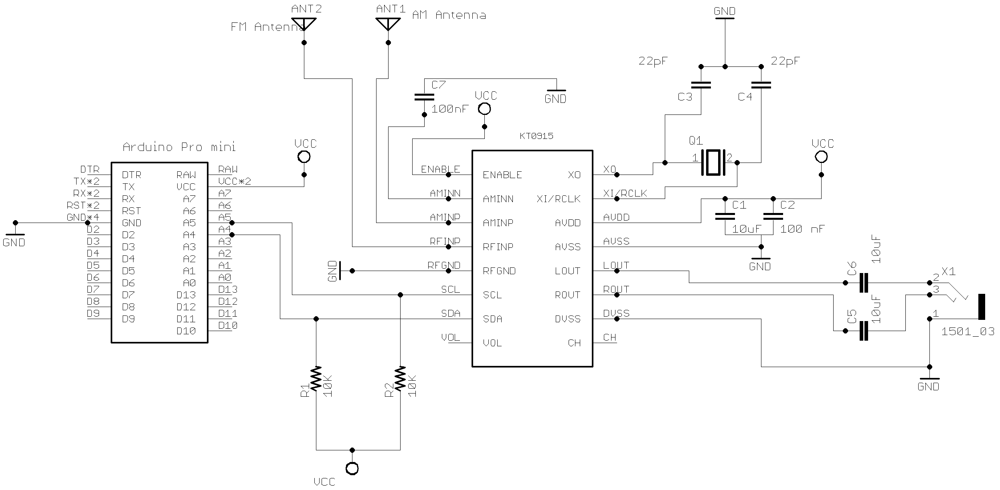
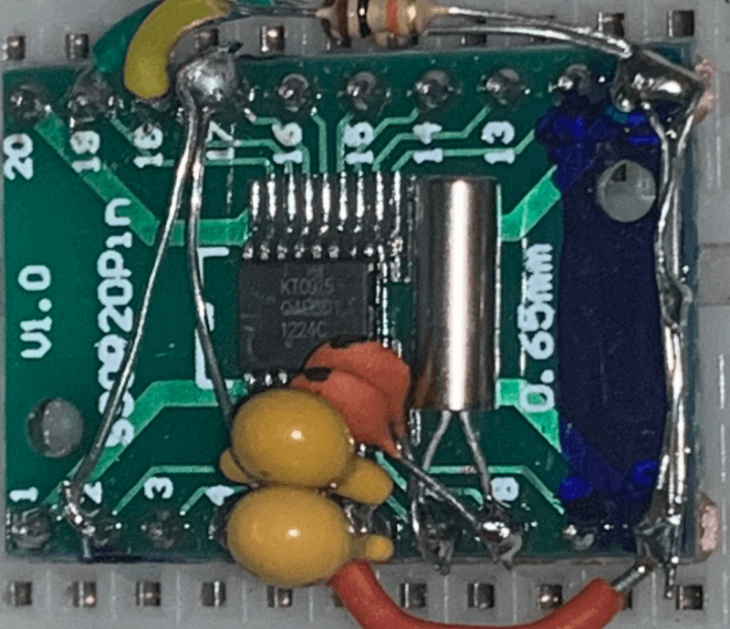
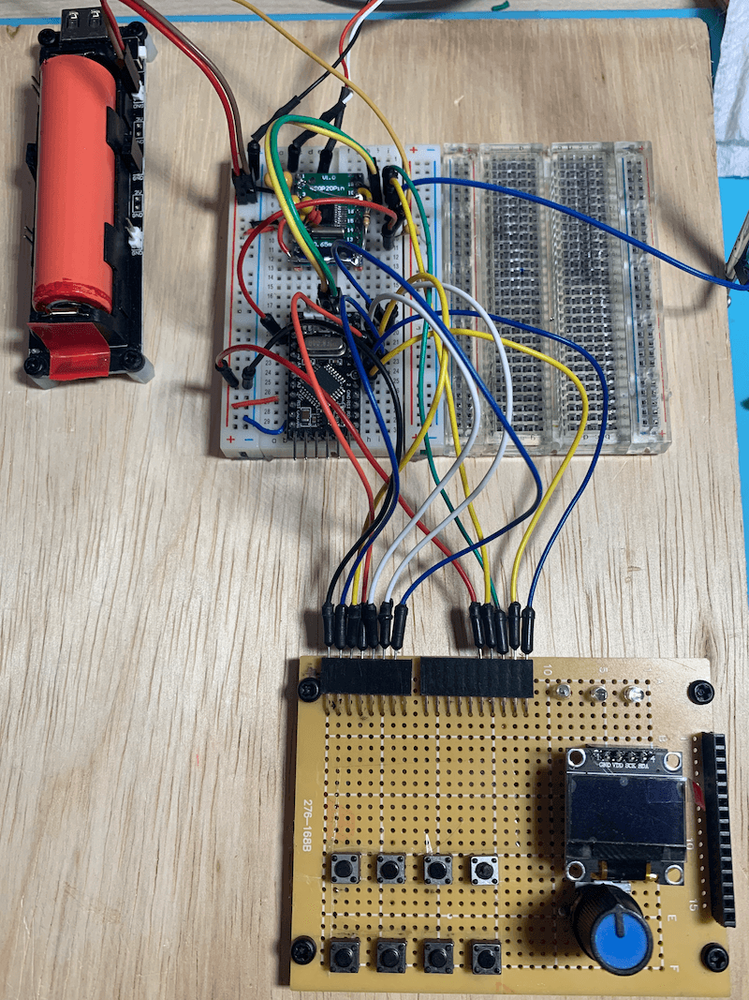

# [PU2CLR KT0915 Arduino Library](https://pu2clr.github.io/KT0915/)

This is an Arduino Library to control the KT0915 DSP receiver from KTMicro. The KT0915 is an integrated circuit that provides full band receiver on FM and AM (MW/SW/LW).

[Copyright (c) 2020 Ricardo Lima Caratti](https://pu2clr.github.io/KT0915#mit-license).

Contact: __pu2clr@gmail.com__.

__If you find this project useful, consider making a donation so that the author can purchase components and modules for improvements and testing of this library.__
[Click here to donate](https://www.paypal.com/donate/?business=LLV4PHKTXC4JW&no_recurring=0&item_name=Consider+making+a+donation.++So+I+can+purchase+components+and+modules+for+improvements+and+testing+of+this+library.&currency_code=USD)

## About Me

I hold a Master's degree in Educational Technology from the Federal University of Ceará, where I delved into the ways technology can enhance learning experiences. My passion for computer science led me to specialize in it, focusing on Distributed Systems Development with an Object-Oriented approach, at the University of Brasília. My academic journey began with a Bachelor's degree in Information Systems from the União Pioneira de Integração Social (UPIS-Brasília). Outside the classroom, my main hobbies are electronics and Amateur Radio. 

Be a member of Facebook group [DSP receivers for hobbyists](https://www.facebook.com/groups/2655942598067211)

## Donate 

If you find this project useful, consider making a donation so that the author of this library can purchase components and modules for improvements and testing of this library. [Click here to donate.](https://www.paypal.com/donate/?business=LLV4PHKTXC4JW&no_recurring=0&item_name=Consider+making+a+donation.++So+I+can+purchase+components+and+modules+for+improvements+and+testing+of+this+library.&currency_code=USD)

# Contents

1. [Preface](https://pu2clr.github.io/KT0915#preface)
2. [Your support is important](https://pu2clr.github.io/KT0915#your-support-is-important)
3. [Library Features](https://pu2clr.github.io/KT0915#library-features)
4. [MIT License](https://pu2clr.github.io/KT0915#mit-license)
5. [Library Installation](https://pu2clr.github.io/KT0915#library-installation)
6. [About KT0915 DSP radio](https://pu2clr.github.io/KT0915#about-kt0915-dsp-radio)
   * [KT0915 pinout](https://pu2clr.github.io/KT0915#kt0915-pinout)
7. [SCHEMATIC](https://pu2clr.github.io/KT0915#schematic)
8.  [API Documentation](https://pu2clr.github.io/KT0915/extras/docs/html/index.html)
9.  [Source code - Examples](https://github.com/pu2clr/KT0915/tree/master/examples)
10. [Videos](https://pu2clr.github.io/KT0915#videos)
11. [References](https://pu2clr.github.io/KT0915#references)

## Preface

The KT0915 is a full band AM (LW, MW and SW) and FM DSP receiver that can provide you a easy way to build a high quality radio with low cost. This device, will surprise hobbyists and experimenters with its simplicity.

In this document you will see Arduino source codes, schematics, examples and tips to help you to build a receiver based on Arduino board and the KT0915 device.  The project and examples shown here do not intend to be a real receiver for exigent listener. However, it is possible to start with it and after add some improvements. On the other hand, with the simple circuits shown here, the experimenter may be surprised with its performance.



[PU2CLR KT0915 Arduino LIbrary - AM (MW and SW) and FM receiver with KT0915](https://youtu.be/H6SwbuN3niU)

 



[Video Tutorial](https://youtu.be/f3P6KL0XJpw)

## See also

* [PU2CLR Si4735 Library for Arduino](https://pu2clr.github.io/SI4735/). This library was built based on “Si47XX PROGRAMMING GUIDE; AN332” and it has support to FM, AM and SSB modes (LW, MW and SW). It also can be used on all members of the SI47XX family respecting, of course, the features available for each IC version;
* [PU2CLR SI4844 Arduino Library](https://pu2clr.github.io/SI4844). This is an Arduino library for the SI4844, BROADCAST ANALOG TUNING DIGITAL * DISPLAY AM/FM/SW RADIO RECEIVER,  IC from Silicon Labs.  It is available on Arduino IDE. This library is intended to provide an easier interface for controlling the SI4844.
* [PU2CLR AKC695X Arduino Library](https://pu2clr.github.io/AKC695X/). The AKC695X is a family of IC DSP receiver from AKC technology. The AKC6955 and AKC6959sx support AM and FM modes. On AM mode the AKC6955 and AKC6959sx work on LW, MW and SW. On FM mode they work from 64MHz to 222MHz.
* [PU2CLR KT0915 Arduino Library](https://pu2clr.github.io/KT0915/). The KT0915 is a full band AM (LW, MW and SW) and FM DSP receiver that can provide you a easy way to build a high quality radio with low cost.
* [PU2CLR BK108X](https://pu2clr.github.io/BK108X/). The BK1086 and BK1088 are DSP receivers from BAKEN. The BK1088 is a BROADCAST FM and AM (LW, MW and ) RECEIVER and BK1086 is a subset of the BK1088 (it does not have LW and SW acording to the Datasheet).
* [PU2CLR RDA5807 Arduino Library](https://pu2clr.github.io/RDA5807/). The RDA5807 is a FM DSP integrated circuit receiver (50 to 115MHz) with low noise amplifier support. This device requires very few external components if compared with other similar devices. It also supports RDS/RBDS functionalities, direct auto gain control (AGC) and real time adaptive noise cancellation function.
* [PU2CLR SI470X Arduino Library](https://pu2clr.github.io/SI470X/). It is a Silicon Labs device family that integrates the complete functionalities for FM receivers, including RDS (Si4703).
* [PU2CLR MCP23008](https://pu2clr.github.io/MCP23008/). It is an Arduino Library to control the MCP23008/MCP23S08 8-Bit I/O Expander. The MCP23008 device provides 8-bit, general purpose, parallel I/O expansion. It can be controlled via I2C bus applications. It is a great and inexpensive device that allow you to add more devices to be controlled by your Arduino board via I2C protocol.
* [PU2CLR - PCF8574 Arduino Library](https://pu2clr.github.io/PCF8574/). It is an Arduino Library to control the PCF8574 8-Bit I/O Expander. The PCF8574 device provides 8-bit, general purpose, parallel I/O expansion. It can be controlled via I²C bus applications. It is a great and inexpensive device that allow you to add more peripherals to be controlled by your Arduino board via I²C protocol.
* [QN8066 FM DSP RX/TX Arduino Library](https://github.com/pu2clr/QN8066). An easy-to-use interface for controlling the QN8066 FM transceiver and receiver.

### More Arduino Projects developed by author 

* [Multipurpose signal generator with SI5351](https://pu2clr.github.io/SI5351/). It is a multipurpose signal generator controlled by Arduino. This project uses the SI5351 from Silicon Labs. The Arduino sketch is configured to control the SI5351 with three channels from 32.768KHz to 160MHz and steps from 1Hz to 1MHz.
* [Shortwave Arduino Transmitter](https://pu2clr.github.io/Small-Shortwave-Transmitter/). This project is about a shortwave transmitter from 3 MHz to 30 MHz. It uses the SI5351 oscillator from Silicon Labs controlled by Arduino. Also, you can use it with a crystal oscillator. In this case, you will not need the SI5351 device and Arduino. 
* [Android and iOS Bluetooth Remote Control for PU2CLR Arduino Library DSP receivers](https://pu2clr.github.io/bluetooth_remote_control/). This project is an extension of the Arduino library projects for: [SI4735](https://pu2clr.github.io/SI4735/); [AKC6959](https://pu2clr.github.io/AKC695X/) and [KT0915](https://pu2clr.github.io/KT0915/). It is a simple example that shows a way to use your smartphone as a remote control via Bluetooth. In order to follow the steps presented here, I am assuming that you have some knowledge in development for mobile devices. Also, you will need to be familiar with the Javascript programming language. The development environment used by this project is the [Apache Cordova](https://cordova.apache.org/docs/en/latest/guide/overview/index.html). Cordova is a open-source mobile development framework that allows you to develop cross-platform applications. That means you can code once and deploy the application in many system, including iOS and Android. 
Cordova provides an easy way to develop for iOS and Android.  
* [Band Pass Filter controlled by Arduino](https://pu2clr.github.io/auto_bpf_arduino/). It is a HF band pass filter controlled by Arduino. It is designed for HF receivers. With this project, you can use a set of up to four HF bandpass filters that can be selected by Arduino. To do that you will need just two digital Arduino pins.

## Your support is important

If you would like to support this library development, consider joining this project via Github. Alternatively, make suggestions on new features and report errors if you find them. Thank you!

## Library Features

This library uses the I²C communication protocol and implements most of the functions offered by the KT0915 (BROADCAST AM / FM / SW / LW RECEIVER).

The main features of this library are listed below.

1. Open Source. It is free. You can use, copy, modify, merge, publish, distribute, sublicense, and/or sell copies of the Software. See [MIT License to know more](https://pu2clr.github.io/AKC695X/#mit-license);
2. Built based on [KT0915 stereo FM / TV / MW / SW / LW digital tuning radio](http://maximradio.altervista.org/akc6955/AKC6955-datasheet-english.pdf);
3. C++ Language and Object-oriented programming. You can easily extend the AKC695X class by adding more functionalities;
4. Available on Arduino IDE (via Manage Libraries). Easy to install and use;
5. Cross-platform. You can compile and run this library on most of board available on Arduino IDE (Examples: ATtiny85, boards based on ATmega328 and ATmega-32u4, ATmega2560, ARM Cortex, STM32, Arduino DUE, ESP32 and more);
6. Simplifies projects based on KT0915 IC;
7. Support to 32.768KHz and external reference clock;
8. Support to audio controlled by the MCU (Arduino)  or potentiometer;
9.  Real time FM stereo or mono indicator;
10. FM stereo or mono selecting;
11. Real time signal level reading;
12. Real time AM and FM carrier to noise ratio information (dB).
13. Bandwidth selection for AM;
14. Custom band support;
15. More than 40 functions implemented.

## MIT License

Copyright (c) 2019 Ricardo Lima Caratti

Permission is hereby granted, free of charge, to any person obtaining a copy of this software and associated documentation files (the "Software"), to deal in the Software without restriction, including without limitation the rights to use, copy, modify, merge, publish, distribute, sublicense, and/or sell copies of the Software, and to permit persons to whom the Software is furnished to do so, subject to the following conditions:

The above copyright notice and this permission notice shall be included in all copies or substantial portions of the Software.

THE SOFTWARE IS PROVIDED "AS IS", WITHOUT WARRANTY OF ANY KIND, EXPRESS OR IMPLIED, INCLUDING BUT NOT LIMITED TO THE ARRANTIES OF MERCHANTABILITY, FITNESS FOR A PARTICULAR PURPOSE AND NONINFRINGEMENT. IN NO EVENT SHALL THE AUTHORS OR COPYRIGHT HOLDERS BE LIABLE FOR ANY CLAIM, DAMAGES OR OTHER LIABILITY, WHETHER IN AN ACTION OF CONTRACT, TORT OR OTHERWISE, ARISING FROM, OUT OF OR IN CONNECTION WITH THE SOFTWARE OR THE USE OR OTHER DEALINGS IN THE SOFTWARE.

 

## Library Installation

You can install this library on your Arduino environment using different methods. The best ways to do that are described below.  



### Installing via Arduino IDE

// TODO

## About KT0915 DSP radio

According to __"Monolithic Digital FM/MW/SW/LW Receiver Radio on a Chip(TM); KT0915"__ document from KTMicro, "the KT0915 is a fully integrated full band AM/FM digital radio receiver IC with patented technologies that offer full band FM/MW/SW/LW functionality, high quality audio performance, simple design and low BOM cost.
The direct frequency and volume control interface help custumers to maintain the classic looks of their existing products.

Thanks to the patented tuning technology, the receiver maintains good signal reception with short antenna. The chip consumes only 22mA current and can be powered by 2 AAA batteries. Another useful feature is that the volume and channel setup can be preserved in standby mode without external memories. KT0915 supports a wide range of reference clocks from 32.768KHz to 26MHz, hence can share system clocks with a varieties of MCUs further reducing the system BOM cost.

With high audio performance, fully integrated features and low BOM cost, KT0915 is ideal for various FM/MW/SW/LW applications and products".

### KT0915 features

1. Worldwide full band FM/MW/SW/LW support FM: 32MHz-110MHz
   * FM: 32MHz-110MHz
   * MW: 500KHz-1710KHz 
   * SW: 1.6MHz~32MHz 
   * LW: 150KHz ~ 280KHz
2. Fully integrated frequency synthesizer with no external component
3. High Sensitivity
   * 1.6uVEMF for FM
   * 16uVEMF for AM
4. High Fidelity
   * SNR (FM/AM): 60dB/55dB
   * THD: 0.3%
5. Low supply voltage: 2.2V to 3.6V, can be supplied by 2 AAA batteries
6. Automatic antenna tuning
7. Adjustable AM channel filters (2k/4k/6KHz)
8. Embedded FM SNR meter
9.  Fast seek/Tune
10. Integrated stereo headphone driver I²C control interface for MCU
11. Support traditional dial and digital key for frequency tuning and volume control
12. Memorize channel and volume in standby mode
13. Low Supply Current - 22mA (operating) <15uA (standby)
14. Support both 32.768KHz and 38KHz crystal
15. Support continuous reference frequency from 32.768KHz to 26MHz

Source: __"Monolithic Digital FM/MW/SW/LW Receiver Radio on a Chip(TM); KT0915"__ document from KTMicro

### KT0915 Pinout

 | Pin Number  | Pin Name  | Description |
 | ----------  | --------  | ----------- |
 | 1           | CH        | Channel Adjustment. Used to deal with mechanical tune option |
 | 2           | DVSS      | Digital Ground |
 | 3           | ROUT      | Righ channel audio output |
 | 4           | LOUT      | Left channel audio output |
 | 5           | AVSS      | Analog ground |
 | 6           | AVDD      | Power Supply |
 | 7           | XI/RCLK   | Crystal input or reference clock input setup |
 | 8           | XO        | Crystal Output |
 | 9           | ENABLE    | Chip enable. Tied to an internal 600kohm pull down resistor |
 | 10          | AMINN     | AM RF negative input |
 | 11          | AMINP     | AM RF positive input |
 | 12          | RFINP     | FM RF input |
 | 13          | RFGND     | RF ground |
 | 14          | SCL       | SCL of I²C bus. Tied to an internal 47kohm pull-up resistor |
 | 15          | SDA       | SDA of I²C bus. Tied to an internal 47kohm pull-up resistor |
 | 16          | VOL       | Volume adjustment. Used to deal with mechanical volume control |

### KT0915 SSOP16L package

#### About the Pin 1 (CH) and Pin 16 (VOL)

The KT0915 can be configured to deal with mechanical tuning via a variable resistors. For example, you can use a variable resistor to control the audio volume and another to tuninig the receiver. This resource is  enabled by setting the internal register GPIOCFG (Address 0x1D) of the device. The dial can be a variable resistor with the tap connected to CH and VOL as well. The divided voltage at the tap is processed by the internal KT0915  analog to digital converter (ADC). Finally, the converted datas are stored into the internal registers of the KT0915 device.

By default, this library the tune and volume are conttrolled by the MCU (Arduino). However, you can sets the mechanical feature by calling setTuneDialModeOn and setVolumeDialModeOn. See [API Documentation](https://pu2clr.github.io/KT0915/extras/docs/html/index.html).

See [KT0915 - Monolithic Digital FM/MW/SW/LW ReceiverRadio-on-a-Chip™](http://aitendo3.sakura.ne.jp/aitendo_data/product_img/ic/radio/KT0915%20/KT0915_datasheet_V022_aitendo.pdf); pages: 8, 9, 10 and 20.

## SCHEMATIC

You can use the Typical Application Circuit suggested by the KTMicro. This circuit can be found in the document KT0915-Monolithic Digital FM/MW/SW/LW Receiver Radio-on-a-Chip.  The main porpuse of this prototype below is testing de KT0915 Arduino Library. It does not intend to be a real radio for exigent listener. However, it is possible to start with it and after include some devices to improve, for example,  its sensibility beyond other desired features.  The schematic below does not use the ferrite antenna as suggested by KTMicro and no front-en as well.  See [KT0915 - Monolithic Digital FM/MW/SW/LW ReceiverRadio-on-a-Chip™](http://aitendo3.sakura.ne.jp/aitendo_data/product_img/ic/radio/KT0915%20/KT0915_datasheet_V022_aitendo.pdf); page 24.

 

 

__The KT0915 is a 3.3V part. If you are not using a 3.3V version of Arduino, you have to use a kind of 5V to 3.3V bidirectional converter. It is important to say that just power the KT0915 device with 3.3V from Arduino board is not enough. You have to be aware that the Arduino that operates with 5V, the digital pins and the I²C bus will send 5V signals to the KT0915 device. That configuration can make the system unstable or damage the device__.  

### Parts

The table below shows the component parts used to build the receiver prototype based on KT0915

 

| Components |  Value    | Description |
| ---------- |  -------- | ----------- |
|    C1      |  10uF     | Ceramic or tantalum capacitor |
|    C2      |  100nF    | Ceramic or tantalum capacitor |
|   C3, C4   |  22pF     | Supply decoupling capacitor - Ceramic or tantalum capacitor |
|   C5, C6   |  10uF     | Electrolytic or tantalum capacitor |
|    C7      |  100nF    | AC coupling capacitor |  
|    Q1      | 32.768KHz | Crystal |
|   R1, R2   |  10K      | I²C buss Pull up ristors |
|   Arduino  | Pro Mini  | 3.3V 8Mhz |
|   KT0915   | DSP       | FM and AM receiver |
|    VCC     | 3.3V      | Baterry |

 

## Photos

 

 

## Videos

[PU2CLR KT0915 Arduino LIbrary - First Test](https://youtu.be/H6SwbuN3niU)
[PU2CLR KT0915 Arduino Library - Sound testing](https://youtu.be/L3R1hmw8tqg)

## References

* [KT0915 - Monolithic Digital FM/MW/SW/LW ReceiverRadio-on-a-Chip™](http://aitendo3.sakura.ne.jp/aitendo_data/product_img/ic/radio/KT0915%20/KT0915_datasheet_V022_aitendo.pdf)
* [Radio, yes AM-SW-FM radio by DSP radio chip](https://hackaday.io/project/12944-radio-yes-am-sw-fm-radio-by-dsp-radio-chip)
* [KT0915_DSP_RADIO-fullscreen-info](https://github.com/kodera2t/KT0915_DSP_RADIO-fullscreen-info)
* [KT0915 Arduino](https://easyeda.com/wolfezrawilliam/KT0915-Arduino)
